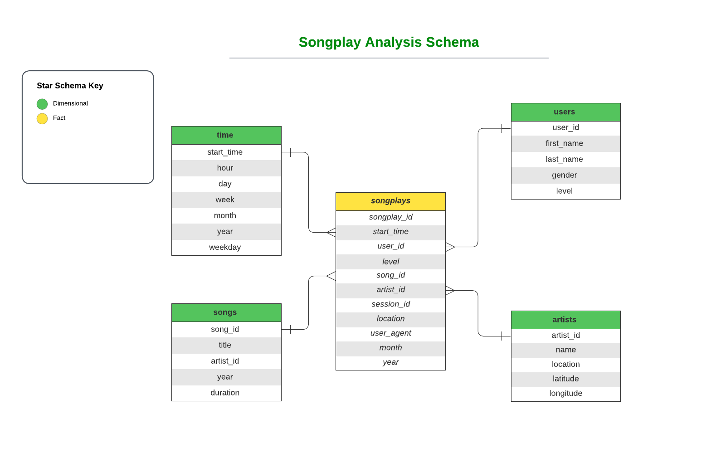
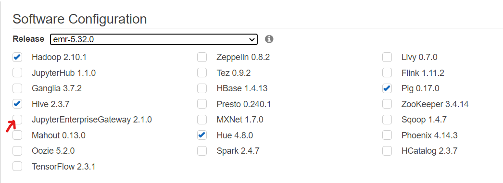

# Project: Data Lake - Spark & AWS EMR 

A music streaming startup, Sparkify, has grown their user base and song database even more and want to move their data warehouse to a data lake. Their data resides in S3, in a directory of JSON logs on user activity on the app, as well as a directory with JSON metadata on the songs in their app.

The main role is to build an ETL pipeline that extracts their data from S3, processes them using Spark, and loads the data back into S3 as a set of dimensional tables. This will allow their analytics team to continue finding insights in what songs their users are listening to.

## Schema Design

### This project uses the star schema as follows:



### Creating Sparkify Database and Tables

- Use `select` statements in `etl.py` to create and populate the tables with specific columns.
- Use `filter` and `dropDuplicates` to maintain the tables from any redundancy or null values.


## Database ETL Pipeline
- Use `read` and `write` spark statements to extract your data from sources `Song data` and `Log data` on S3 bucket in `json` format then load your structured tables in columnar format `parquet`.
- Add AWS credentials to `dl.cfg`.
- Create `EMR` cluster on AWS EMR and specify the version needed for Spark.
- Run `etl.py` on the cluster to process the entire dataset from S3, perfrom the transformation and load your processed data in partitioned analytics tables on S3.

## General Instructions
- If you choose an EMR cluster of the version -5.32.0 or later, make sure to go to Advanced Options and check JupyterEnterpriseGateway to be able to run Jupyter Notebook.



- Make sure to change your S3 paths to the native filesystem `s3n://` to keep your executors from being removed during runtime and prevent the the stalling of your task (Only in AWS EMR).
- The output data written to the user S3 bucket is added to the repo in `output` folder for song play analysis.

<br>

## Example Queries for Songplays table
<br>

```
songplays_df.count()
```
322

<br>
<br>


```
songplays_df.limit(5).toPandas()
```

| | songplay_id | start_time | user_id | level | song_id | artist_id | session_id | location | user_agent | year | month |
| --- | --- |  --- |  --- |  --- |  --- |  --- |  --- |  --- |  --- |  --- |  --- | 
| 0 | 2267742732288 | 2018-11-25 16:14:24.796 | 49 | paid |	SOBONKR12A58A7A7E0 | AR5E44Z1187B9A1D74 | 923 |	San Francisco-Oakland-Hayward, CA |	Mozilla/5.0 (Windows NT 5.1; rv:31.0) Gecko/20... |	2018 |	11 |
| 1 | 2267742732289 | 2018-11-22 01:59:04.796 | 15 | paid |	SOBONKR12A58A7A7E0 | AR5E44Z1187B9A1D74 | 818 |	Chicago-Naperville-Elgin, IL-IN-WI | "Mozilla/5.0 (X11; Linux x86_64) AppleWebKit/5... | 2018 |	11 |
| 2	| 2267742732290 | 2018-11-02 18:02:42.796 |	50 | free |	SOBONKR12A58A7A7E0 | AR5E44Z1187B9A1D74 | 207 |	New Haven-Milford, CT |	"Mozilla/5.0 (Windows NT 6.3; WOW64) AppleWebK... |	2018 |	11 |
| 3	| 2267742732291 | 2018-11-02 16:35:00.796 |	50 | free |	SOBONKR12A58A7A7E0 | AR5E44Z1187B9A1D74 | 156 |	New Haven-Milford, CT |	"Mozilla/5.0 (Windows NT 6.3; WOW64) AppleWebK... |	2018 |	11 |
| 4 | 2267742732292 | 2018-11-04 15:39:36.796 | 78 | free | SOBONKR12A58A7A7E0 | AR5E44Z1187B9A1D74 | 176 | Indianapolis-Carmel-Anderson, IN | Mozilla/5.0 (Windows NT 6.1; rv:31.0) Gecko/20... | 2018 |	11 |

<br>

```
songplays_df.groupBy('user_id').count().orderBy(F.desc('count')).show()
```


|user_id|count|
|  ---  | --- |
|     49|   41|
|     80|   31|
|     97|   28|
|     44|   20|
|     73|   18|
|     15|   17|
|     88|   17|
|     29|   14|
|     24|   13|
|     36|   11|
|     25|   10|
|     58|    9|
|     30|    8|
|     95|    7|
|     85|    7|
|     16|    6|
|     50|    5|
|     42|    5|
|     82|    3|
|     52|    2|

only showing top 20 rows

